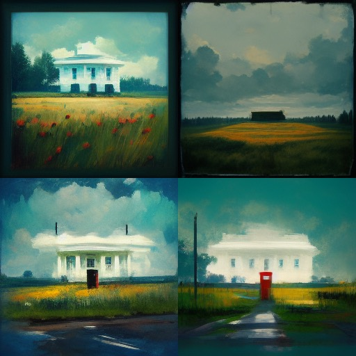
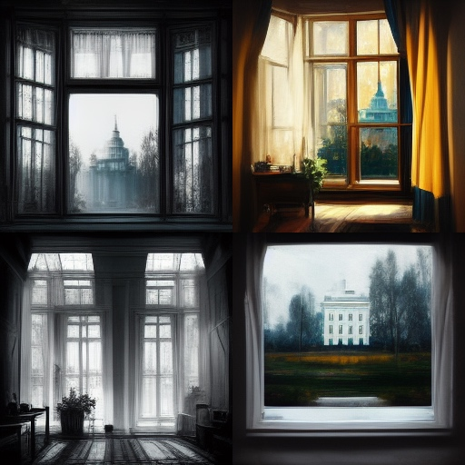
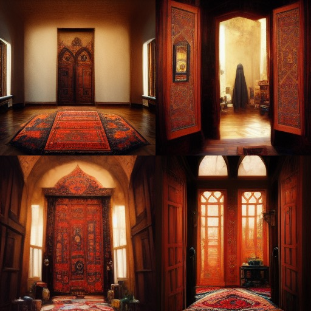
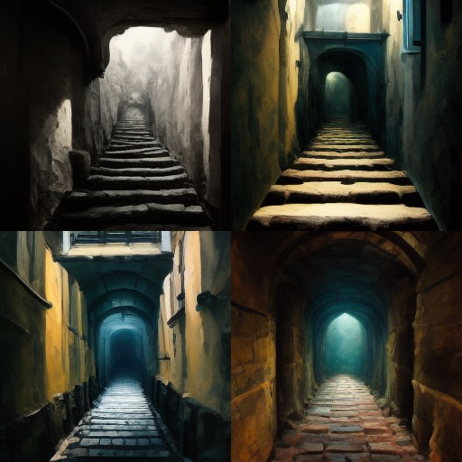
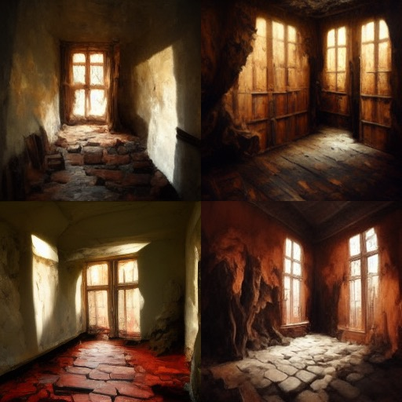
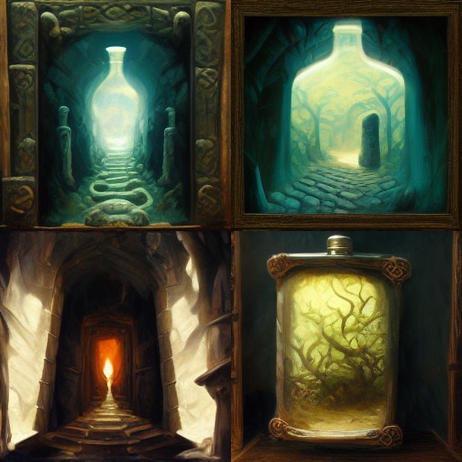

+++
title = "Generating Zork Artwork from the Room Descriptions"
date = 2022-08-20T16:31:31-06:00
tags = ["games", "ai"]
+++

I found a [thread on lobste.rs](https://lobste.rs/s/wp9t0b/adventure_game_graphics_with_dall_e_2) recently about generating level art for classic point-and-click games using DALL-E 2. The comments mentioned that it would be interesting to feed room descriptions from text adventures to DALL-E 2. I [gave it a shot](https://imgur.com/a/i4KzZ9f) and got some feedback in the comments to make more. So I decided to take an hour to play a bit of Zork and see what images it AI could generate from the text.

I decided to try [Midjourney's AI image generator](https://www.midjourney.com/home/) because I had already used DALL-E 2 quite a bit and was interested in seeing how Midjourney would respond to the prompts. I used the text directly from Zork, only making edits when a word would trigger a blocklist.

Here are scenes from the beginning of Zork, with images generated by Midjourney. I used the first images it generated, with no adjustments or variants.

> You are standing in an open field west of a white house, with a boarded front door. There is a small mailbox here.

> You are behind the white house.  In one corner of the house there is a small window which is slightly ajar.

> You are in the kitchen of the white house.  A table seems to have been used recently for the preparation of food.  A passage leads to the west and a dark staircase can be seen leading upward. To the east is a small window which is open.

> You are in the living room.  There is a door to the east, a wooden door with strange gothic lettering to the west, which appears to be nailed shut, and a large oriental rug in the center of the room.

> You are in a dark and damp cellar with a narrow passageway leading east, and a crawlway to the south.  On the west is the bottom of a steep metal ramp which is unclimbable.

> This is a small room with passages off in all directions. Bloodstains and deep scratches (perhaps made by an axe) mar the walls. A troll, brandishing an axe, blocks all passages out of the room.

## Thoughts

I think these images are beautiful! I like that Midjourney has a more painterly style compared to DALL-E 2; the generated images look like concept art.

In [the thread on lobste.rs](https://lobste.rs/s/wp9t0b/adventure_game_graphics_with_dall_e_2) brudish said, "Eventually being able to have art automatically generated from room descriptions would be incredible and something I hope to see as possible someday". So is it possible? That depends on what you are looking for.

At the moment, I think this is a wonderful artistic interpretation of Zork. But if you want a perfect depiction of the game there are still quite a few issues. Here's some I quickly identified, though I am sure there are more.

1. There is no continuity between the generated images. The scene outside the window would ideally show the kitchen inside the house. And the AI didn't know the troll room was underground lit by a lantern.
2. The AI gets confused by similar words or ideas. Many of the images of the house seem very ornate, probably influenced by the words "the white house".
3. The images don't always accurately depict the location. The second image, *You are behind the white house...*, shows the player already inside the house.

Although the images weren't perfect, they complemented the game very well. The concept art style offered a glimpse into Zork's world and grounded the game more than a wall of text ever could.

## Just for fun

While I was in the mood, I generated one last set of images based on the intro text for [Thy Dungeonman](https://homestarrunner.com/dungeonman) from Homestar Runner.

> Ye find yeself in yon dungeon. Ye see a SCROLL. Behind ye SCROLL is a FLASK. Obvious exits are NORTH, SOUTH, and DENNIS.

With such a whimsical and nondescript prompt I'm not sure what I was expecting. I really love both the flask-shaped tunnel, and the interpretation of placing the scene *inside* the flask itself!

These text-to-image generators have come a long way in a short time and I look forward to seeing where the next few years take us. Perhaps a future text adventure game could be designed with two streams of text: one for the player, and a second stream of text designed to assist the image generator. But for now, I must try to *get ye flask*.
